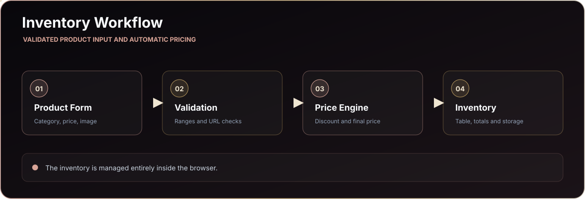

<p align="center">
  
</p>

<p align="center">
  <a href="https://itaygoldenberg.github.io/Clothing-Store-Inventory-Manager/"></a>
  <a href="https://github.com/itaygoldenberg/Clothing-Store-Inventory-Manager"></a>
  <a href="https://www.linkedin.com/in/itay-goldenberg/"></a>
</p>

<p align="center">
  <a href="#overview">Overview</a>&nbsp;&middot;&nbsp;
  <a href="#features">Features</a>&nbsp;&middot;&nbsp;
  <a href="#workflow">Workflow</a>&nbsp;&middot;&nbsp;
  <a href="#technology">Technology</a>&nbsp;&middot;&nbsp;
  <a href="#running-locally">Local setup</a>
</p>

> [!NOTE]
> A frontend inventory project built around practical validation, pricing calculations and persistent state.

## Overview

Clothing Store Inventory Manager is a multi-page frontend application for recording apparel, calculating discounts and maintaining a clear product inventory.

The interface combines a practical input workflow with automatic final-price calculations, visual pricing states and local persistence, all without a server dependency.

<table><tr><td align="center" width="25%"><strong>8</strong><br /><sub>categories</sub></td><td align="center" width="25%"><strong>AUTO</strong><br /><sub>discount math</sub></td><td align="center" width="25%"><strong>AVG</strong><br /><sub>price summary</sub></td><td align="center" width="25%"><strong>LOCAL</strong><br /><sub>inventory state</sub></td></tr></table>

| Project detail | Implementation |
|---|---|
| Catalog | Eight clothing categories with item details |
| Pricing | Original price, discount and calculated final price |
| Dashboard | Inventory count and average price |
| Persistence | localStorage-backed catalog |

## Contents

- [Overview](#overview)
- [Features](#features)
- [Workflow](#workflow)
- [Technology](#technology)
- [Project structure](#project-structure)
- [Running locally](#running-locally)
- [Operational notes](#operational-notes)
- [Author](#author)

## Features

### Product entry

Users can record category, description, color, price, discount and an image URL. Numeric ranges and URLs are validated before an item is accepted.

### Pricing intelligence

The final price is calculated automatically from the original price and discount. Color-coded values make the pricing state easier to scan.

### Inventory operations

Items appear in a structured inventory table, can be deleted individually and contribute to the live item-count and average-price summaries.

## Workflow

<p align="center">
  
</p>

## Technology

<p align="center">
  
</p>

| Technology | Role |
|---|---|
| HTML5 | Multi-page structure and inventory form |
| CSS3 | Boutique-inspired responsive interface |
| JavaScript | CRUD behavior, validation and calculations |
| Web Storage API | Persistent inventory state |

## Project structure

```text
Clothing-Store-Inventory-Manager/
|-- index.html     Inventory workspace
|-- about.html     Project information
|-- style.css      Shared design language
|-- main.js        Inventory and pricing logic
|-- docs/          README-only visual assets
`-- README.md      Project documentation
```

## Running locally

```bash
git clone https://github.com/itaygoldenberg/Clothing-Store-Inventory-Manager.git
cd Clothing-Store-Inventory-Manager
```

Open `index.html` directly or use VS Code Live Server for local page navigation.

## Operational notes

- The application has no remote database or authentication layer.
- Inventory data is specific to the current browser profile.

## Author

<p align="center">
  <strong>Itay Goldenberg</strong><br />
  Full Stack Developer Student
</p>

<p align="center">
  <a href="https://github.com/itaygoldenberg"></a>
  <a href="https://www.linkedin.com/in/itay-goldenberg/"></a>
</p>
